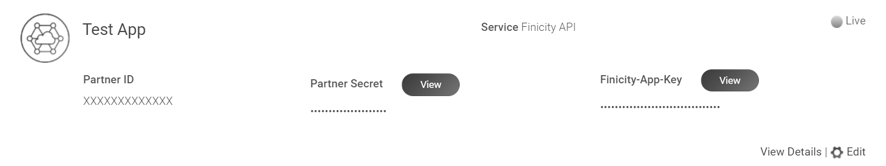
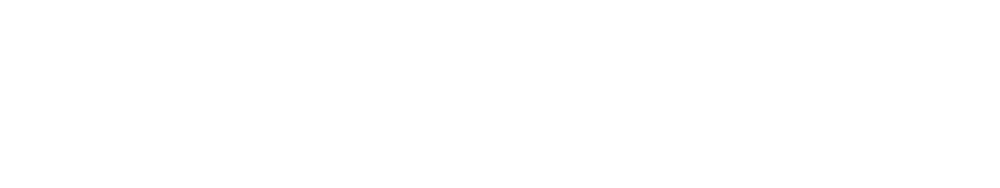
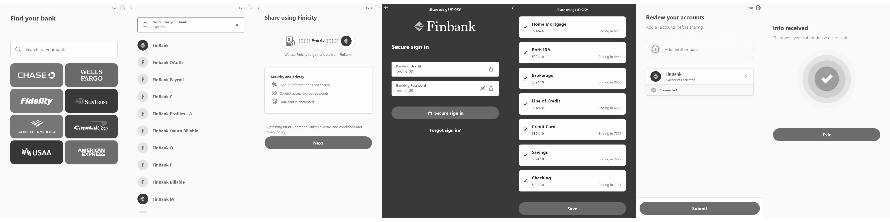
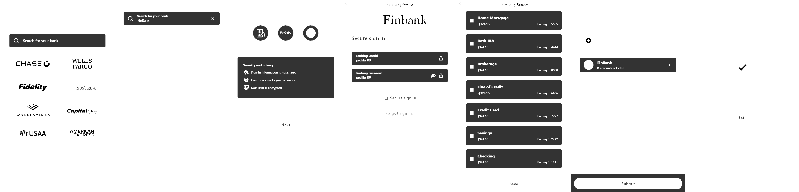

# finicity-openapi
[](https://www.finicity.com/#gh-light-mode-only)
[](https://www.finicity.com/#gh-dark-mode-only)

## Overview

The OpenAPI specification for [Finicity APIs](https://docs.finicity.com/) (🇺🇸), along with a suite of [tests](./tests/src/test/java/com/mastercard/finicity/client/api) using a generated API client and the [Finicity Test Drive](https://signup.finicity.com/).

## Workflows

The following workflows ensure the API specification stays in good shape and can be used to consume the Finicity APIs from your application:

[](https://github.com/Finicity-Mastercard/finicity-openapi/actions/workflows/prettier.yml)
[](https://github.com/Finicity-Mastercard/finicity-openapi/actions/workflows/swagger-editor.yml)
[](https://github.com/Finicity-Mastercard/finicity-openapi/actions/workflows/redoc.yml)
[](https://github.com/Finicity-Mastercard/finicity-openapi/actions/workflows/openapi-generator.yml)
[](https://github.com/Finicity-Mastercard/finicity-openapi/actions/workflows/tests.yml)

## Specification
[YAML ⤓](./finicity.yaml) | [Swagger Editor ⬈](https://editor.swagger.io/?url=https%3A%2F%2Fraw.githubusercontent.com%2FFY-Dev-Relations%2Ffinicity-openapi%2Fmain%2Ffinicity.yaml) | [Redoc ⬈](https://redocly.github.io/redoc/?url=https://raw.githubusercontent.com/Finicity-Mastercard/finicity-openapi/main/finicity.yaml)

## Tests
### Things to Know :point_down:

* The [test project](./tests) generates an API client library from the API specification like you would do in a real application (OpenAPI Generator is used for that)
* A [free Finicity account](https://signup.finicity.com/) is required to obtain your **Partner ID**, **Partner Secret** and **Finicity App Key**:

[](./res/dashboard.png?raw=true#gh-light-mode-only)
[](./res/dashboard.png?raw=true#gh-dark-mode-only)

* Before running the tests, you need a **Customer ID**. For that, run [setup.sh](./bin/setup.sh) and use the output of the script in the next sections. This script will call:
  * `addTestingCustomer`
  * `generateConnectUrl` ([Finicity Connect](https://docs.finicity.com/)). Simply open the URL and add to your test customer all accounts from [`profile_09`](https://docs.finicity.com/test-the-apis/#test-the-apis-3).
  * `refreshCustomerAccounts`

[](./res/connect-for-tests.png?raw=true#gh-light-mode-only)
[](./res/connect-for-tests.png?raw=true#gh-dark-mode-only)

### Run Tests Locally

1. Clone this repository
2. Run `cd tests && mvn clean test -DpartnerId=*** -DpartnerSecret=*** -DappKey=*** -DcustomerId=***`
3. Expected result:

```
[INFO] -------------------------------------------------------
[INFO]  T E S T S
[INFO] -------------------------------------------------------
…
[INFO] Results:
[INFO]
[INFO] Tests run: 111, Failures: 0, Errors: 0, Skipped: 0
[INFO]
[INFO] ------------------------------------------------------------------------
[INFO] BUILD SUCCESS
[INFO] ------------------------------------------------------------------------
[INFO] Total time:  01:08 min
[INFO] Finished at: 2022-04-20T14:47:43+01:00
[INFO] ------------------------------------------------------------------------
```

### Run Tests in GitHub

1. [Fork this repository](https://github.com/Finicity-Mastercard/finicity-openapi/fork)
2. Go to _Settings_ > _Secrets_ > _Actions_
3. Create new repository secrets: `PARTNER_ID`, `PARTNER_SECRET`, `APP_KEY` and `CUSTOMER_ID`
4. Enable workflows in the _Actions_ tab
5. Click _Run workflow_ under _API Client Tests_. Expected result: :heavy_check_mark:

## What's Next?

The [Finicity API specification](./finicity.yaml) and a [generated API client](./tests) are the only things you need to call Finicity from your application. 

* For other software development frameworks and languages, see: OpenAPI Generator > [Generators List](https://openapi-generator.tech/docs/generators).
* You may also be interested in trying our [Postman collection](https://github.com/Finicity-Mastercard/finicity-postman).

## Guidelines

When updating the Finicity API specification:
1. Ensure it can be rendered without errors in [Swagger Editor](https://editor.swagger.io/?url=https%3A%2F%2Fraw.githubusercontent.com%2FFY-Dev-Relations%2Ffinicity-openapi%2Fmain%2Ffinicity.yaml) or [Redoc](https://redocly.github.io/redoc/?url=https://raw.githubusercontent.com/Finicity-Mastercard/finicity-openapi/main/finicity.yaml)
2. Ensure an API client can be generated using [OpenAPI Generator](https://openapi-generator.tech/)
3. Prettify the YAML using `npx prettier --write --single-quote --prose-wrap always finicity.yaml`
4. Update and/or add tests to the [test project](./tests)
   * Generate new tests by using `true` for `generateApiTests` in the [POM file](./tests/pom.xml)
   * Move the generated classes from `/target/generated-sources/openapi/src/test/` to [`/src`](./tests/src/test/java/com/mastercard/finicity/client/api)
   * Update the generated test methods